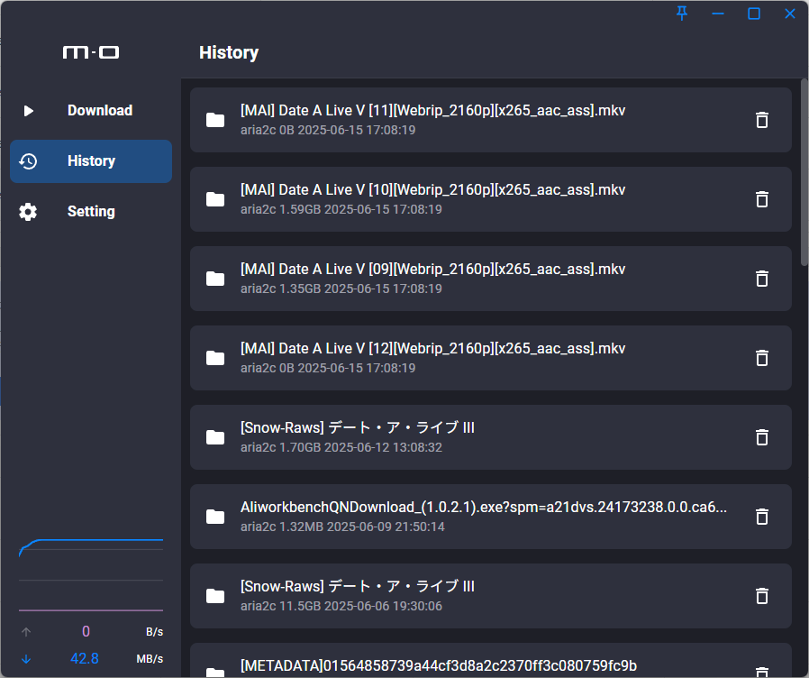
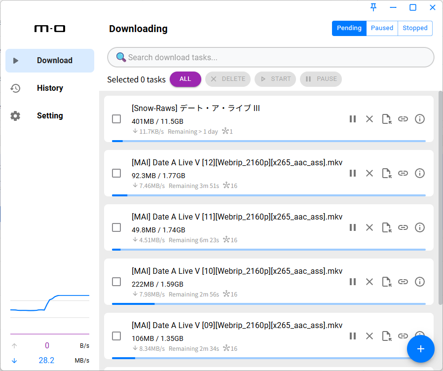

# tauri-motrix

[](https://github.com/taoister39/tauri-motrix/issues?q=is%3Aopen+is%3Aissue+label%3Afeature-request+sort%3Areactions-%2B1-desc)
[](https://github.com/taoister39/tauri-motrix/issues?utf8=✓&q=is%3Aissue+is%3Aopen+label%3Abug)

Tauri Motrix is a full-featured download manager written in Tauri.The purpose is to restructure [Motrix](https://github.com/agalwood/Motrix) open source project.

## Preview

| Dark                             | Light                             |
| -------------------------------- | --------------------------------- |
|  |  |

## Install

Go to the [release page](https://github.com/Taoister39/tauri-motrix/releases) to download the corresponding installation package
Supports Windows (x64 / arm64).

## Features

- 🎨 Material Design Theme (MUI).
- 🚀 Supports 128 threads in a single task
- 📦 Lightweight, small package size
- 🚥 Supports speed limit
- 🔌 Configurable aria2 RPC port and secret for third-party download tools
- 🖥️ Optional minimize to tray on auto launch, configurable in Settings → Display (off by default). Manual launches still show the window.

## RPC downloads

Open **Settings → Aria2 Engine → RPC Settings** to change the RPC port (1024–65535) and optional secret. Copy the RPC address into your browser extension or cloud-drive download tool, and use the same secret there. The default address is `http://127.0.0.1:16801/jsonrpc`.

Saving restarts the built-in aria2 engine and restores its saved task session. If the new port is occupied or the restart fails, the previous settings are retained. Clearing the secret disables RPC authentication.

## Development

To run the development server, execute the following commands after all prerequisites for Tauri are installed:

> [!NOTE]
>
> **If you are using a Windows ARM or Linux ARM device, you need to install [LLVM](https://github.com/llvm/llvm-project/releases) (including clang) and set the environment variable.**
>
> This is because the `ring` crate is compiled using `clang` on Windows ARM and Linux ARM platforms.
> See this [PR](https://github.com/briansmith/ring/pull/2216) for the ongoing work to replace cl.exe with clang-cl.

```Powershell
pnpm i
pnpm check
pnpm tauri dev
```

## Contributions

Issue and PR welcome!

## Acknowledgements

Thanks to the following projects for giving me inspiration and reference:

- [Clash Verge](https://github.com/clash-verge-rev)
- [Motrix](https://github.com/agalwood/Motrix)
- [aria2](https://github.com/aria2/aria2)
- [antd](https://github.com/ant-design/ant-design)
- [rc-util](https://github.com/react-component/util)
- [stylex-swc-plugin](https://github.com/Dwlad90/stylex-swc-plugin)

## License

GPL-3.0 License. See [License here](./LICENSE) for details.
